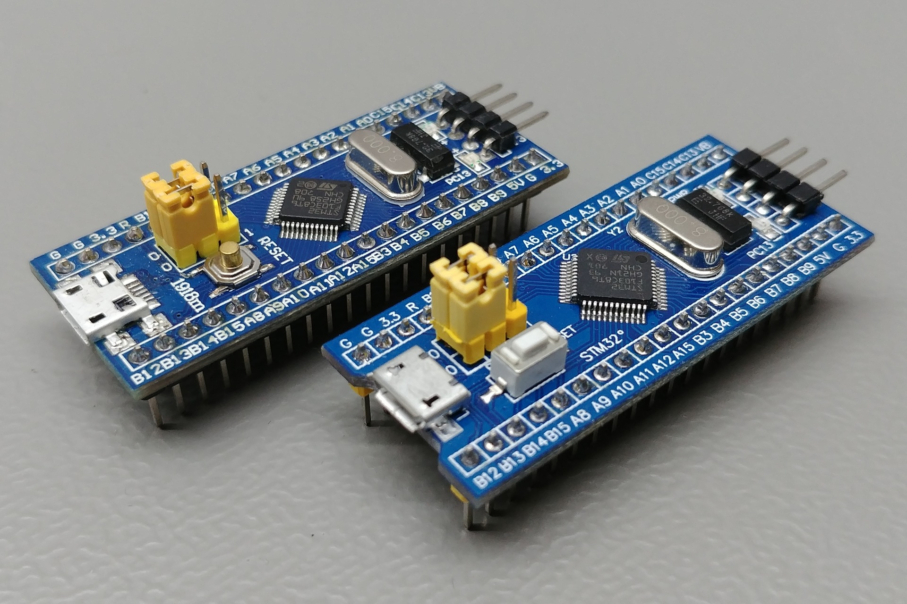
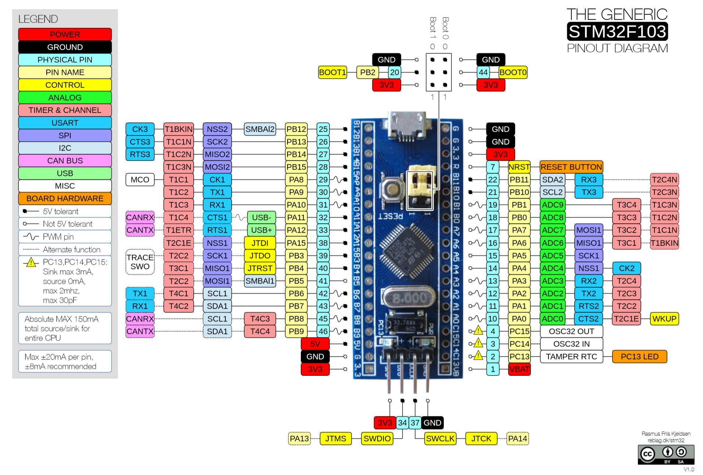

# Hello BluePill




"Hello BluePill" is a basic program for blinking LEDs based on the Stm32 BluePill development board. The development tools used are as follows:
- arm-none-eabi-gcc: version GNU Arm Embedded Toolchain 10.3-2021.10
- openocd: provides programming capabilities, version OpenOCD-20231002-0.12.0
- git bash: provides commands such as rm, any version is applicable.
- mingw64: provides commands such as make, the mingw-make command is copied and renamed to make. Version GCC 13.2.0, https://winlibs.com/#download-release

# Running the script
```
# 1. enter the source code directory Source\hello_bluepill, Compile and Flash
make
openocd -f stlink_bluepill.cfg

# 2. Debugging
telnet 127.0.0.1 4444
reset init # Reset and start, then enter b main in gdb

# 3. GDB
arm-none-eabi-gdb build/hello_pill.elf
target remote :3333
b main
```